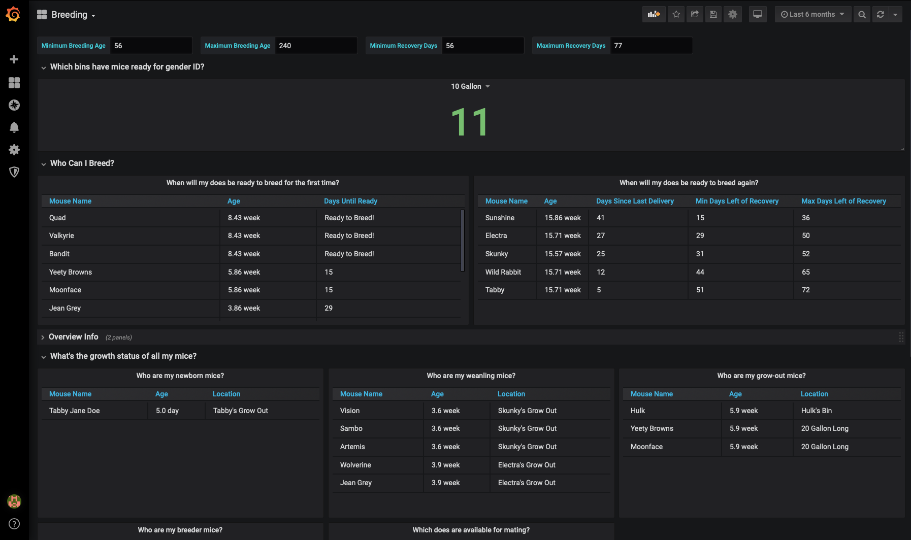
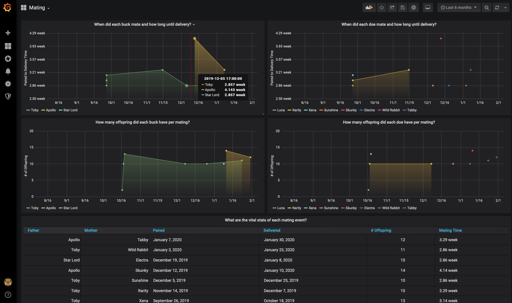

# MausHaus
A program to help (amatuers) with breeding mice.

It has 3 main components:

* PostgreSQL database
* Grafana provisioned with a few canned dashboards
* A Django web app to create the database schema and use the admin application to enter / update data.

A custom webapp for data maintenance could come in the future.

# Requirements
You'll need to have Docker v18 and I think a Docker Hub account if you want to pull my latest container image.

## Developing
You'll need the following:

* Python 3
* PlantUML
* Django

I work on a Mac and am competent on \*nix systems but if you need help on Windows I won't be able to offer much. I know you'll need gitbashprompt at a minimum.

# Goals
This is intended to help the amatuer mouse owner / breeder to manage thier pets and hopefully be more successful at breeding the traits they want.

This is really to set expectations. The target audience is not professionals although I'm open to letting it become useful at that level  I don't want it to become unfriendly to the average mouse owner. It should be not only approachable for first time mouse owners but also helpful to them. 

# Running
1. Run `docker-compose build`
2. Run `docker-compose exec web /bin/ash`
3. In the shell run `python manage.py createsuperuser` and follow the prompts. I highly recommend you use the same credentials as the database.
4. At prompt run `cd src`, then `python manage.py makemigrations`
5. Then run `python manage.py migrate`
6. Type `exit` to exit the shell
7. Run `docker-compose up -d`
8. Open a brower to `localhost:8000/admin`
9. Grafana is at localhost:3000
10. You'll be prompted to login to Grafana, use admin admin as the password and it will prompt you to change.

# User Guide
This is going to have to be good enough. Eventually we should use git pages and have a proper manual.

## Credentials and Environment Setup

1. The database creds are in plain text in docker-compose.yml. This runs locally so this isn't a concern for now. Feel free to change these values.
2. If you do change them you may need to update the superuser account mentioned in the Running section.
3. Same for Grafana, I'd reuse the same creds but first time login is admin / admin. 

## Using Maus Web (the Django web app)

1. Open a brower to `http://localhost:8000/admin/maus_web/`

2. Click Mice, once you create some they will be listed here.

3. Click Add Mouse

Some of these fields don't do anything yet, these are: Codename, Picture, and Is favorite.
Hopefully the rest is self explanatory.
4. Creating associations is manual process, that is you have to create entries in a table to make them. I tried to and will continue to indicate these with friendly names like Mice in a Bin or Trait on a mouse. Navigate to the admin home and select Bins or Cages to create a bin for your mouse to live in.

5. Click Mouse in a Cage and you'll see letting the database know a mouse is in a bin or cage is pretty self explanatory.

6. Traits and Traits on a Mouse don't do anything yet.

## Using the Grafana Dashboards

This is where the real value is, the dashboards are what (hopefully) help you manage your mice easier.

1. Open a brower to `http://localhost:3000/` and log in with your admin creds if prompted.
2. Select Mouse Ages from the dropdown on the top left.

Admittedly not super useful but ymmv.
3. Next up select Bin Maintenance. If you put mice into bins it will tell you which ones are where. If you update last_cleaned each cleaning it will track when you need to clean next. And finally if you have a complex rack setup you can use the rack, elevation, and position fields to find out where a given bin is in a rack and easily locate mice.

4. On the Breeding dashboard you see which bins have mice ready for gender ID (10-15 days after delivery date on a mating), which mice are ready to breed, and which mice are in a few significant growth stages.

5. Finally on the Mating dashboard you can see when matings occurred and what the outcomes were.

